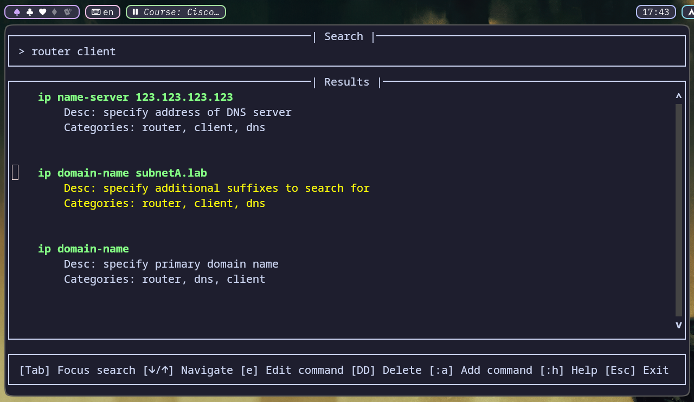
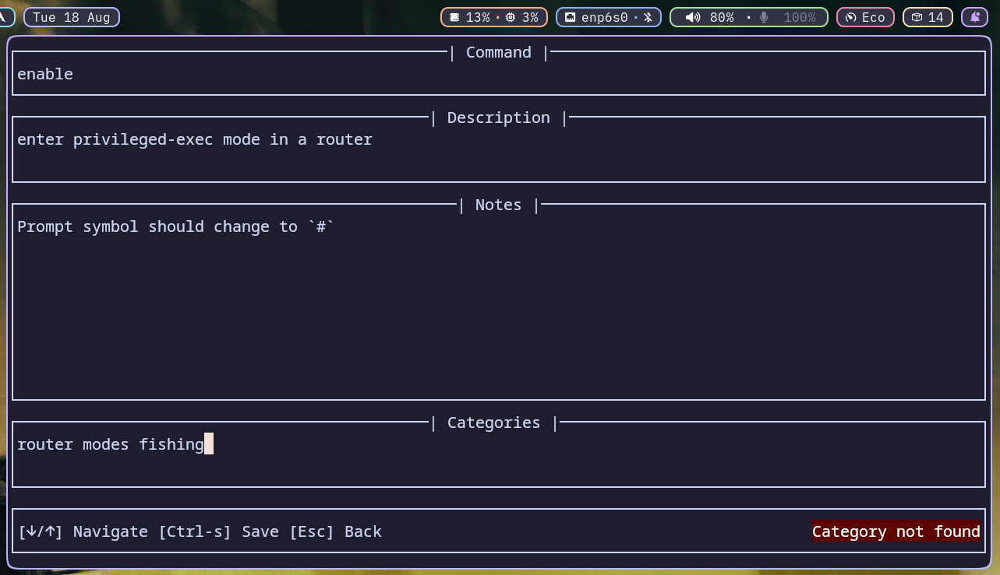
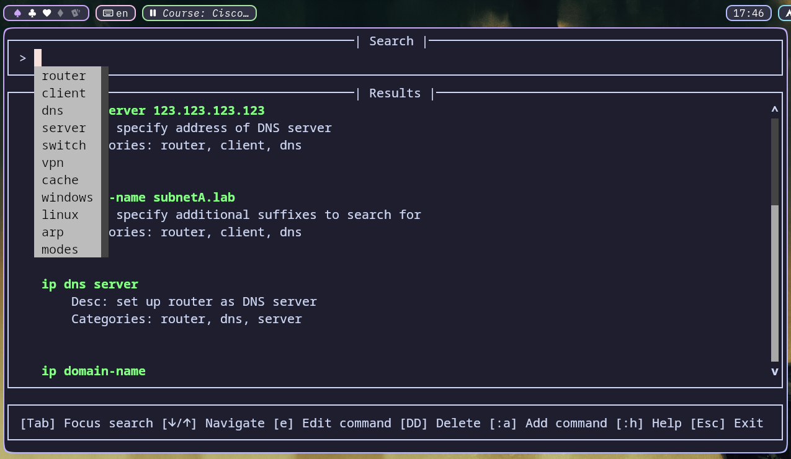

# Cheatsheet Manager





A terminal-based cheatsheet manager built with Python and [prompt_toolkit](https://github.com/prompt-toolkit/python-prompt-toolkit).

## Features

- Search commands by name
- Filter commands by categories
- Interactive terminal UI
- Navigate commands with the keyboard
- Edit existing commands
- Add and delete commands
- Store cheatsheets as JSON
- Autocomplete categories and commands

## Requirements

- Python 3.10+
- `prompt_toolkit`

## Installation

- Clone repo

```
git clone https://github.com/rcj-sec/cheatsheet-manager.git
```

- Download requirements (optionally, creat a virtual environment)

```
python -m venv .venv
source .venv/bin/activate
pip install -r requirements.txt
```

- Execute `main.py`. No arguments will create `cheatsheet.json` in the working directory. Alternatively, pass a JSON file to use. 

```
# if virtual environment was created
/path/to/cloned/repo/.venv/bin/python /path/to/cloned/repo/main.py

# otherwise 
python path/to/cloned/repo/main.py 

# specify a file
python path/to/cloned/repo/main.py file.json
```


